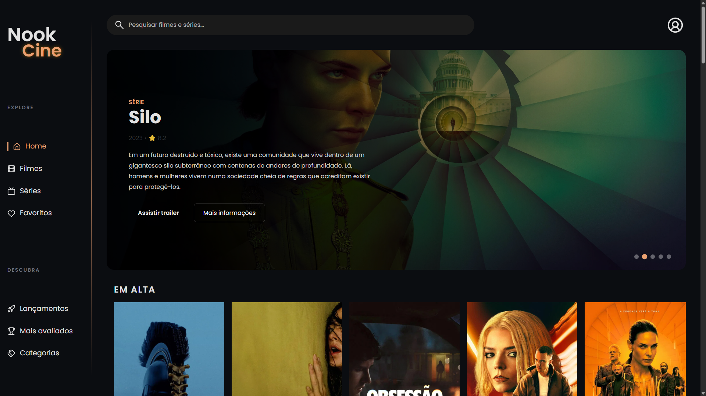

# 🎬 NookCine

O **NookCine** é uma aplicação web desenvolvida para explorar filmes e séries utilizando a API do **The Movie Database (TMDB)**. O projeto foi criado com foco em praticar consumo de APIs, manipulação do DOM, JavaScript moderno e desenvolvimento de interfaces responsivas.

---

## 📷 Preview



---

## 🚀 Funcionalidades

- 🎥 Hero Banner dinâmico
- 🔥 Filmes e séries em destaque
- 🔎 Pesquisa em tempo real
- 📄 Página de detalhes completa
- ▶️ Reprodução de trailers em modal
- ⭐ Avaliações dos títulos
- 📅 Informações como lançamento, categorias e descrição
- 📱 Layout totalmente responsivo
- 🎨 Interface inspirada em plataformas de streaming

---

## 🛠️ Tecnologias Utilizadas

- HTML5
- CSS3
- JavaScript (ES6+)
- TMDB API
- Fetch API
- Lucide Icons

---

## 📚 Conceitos Praticados

Durante o desenvolvimento deste projeto foram aplicados conceitos como:

- Consumo de APIs REST
- Requisições assíncronas com Fetch API
- Async/Await
- Manipulação do DOM
- Modularização do JavaScript
- Eventos
- Responsividade
- Organização de componentes
- Boas práticas de estruturação de código

---

## 📂 Estrutura do Projeto

```text
📦 NookCine
 ┣ 📂 assets
 ┃ ┣ 📂 icons
 ┃ ┣ 📂 images
 ┣ 📂 components
 ┃ ┣  📄 sidebar.html
 ┣ 📂 js
 ┃ ┃ 📂 api
 ┃ ┃ ┣ config.js
 ┃ ┃ ┣ media.js
 ┃ ┃ ┣ tmdb.js
 ┃ ┃ 📂 components
 ┃ ┃ ┣ card.js
 ┃ ┃ ┣ hero.js
 ┃ ┃ ┣ section.js
 ┃ ┃ ┣ sidebar.js
 ┃ ┃ 📂 services
 ┃ ┃ ┣ favorites.js
 ┃ ┃ ┣ search.js
 ┃ ┣ details.js
 ┃ ┣ hero.js
 ┃ ┣ search.js
 ┃ ┣ section.js
 ┃ ┗ ui.js
 ┣ 📄 index.html
 ┣ 📄 movies.html
 ┣ 📄 series.html
 ┣ 📄 details.html
 ┗ 📄 favorites.html
```

---

## 🎯 Objetivo

Este projeto foi desenvolvido com o objetivo de consolidar conhecimentos em desenvolvimento Front-end através da criação de uma aplicação completa consumindo uma API pública, priorizando organização, experiência do usuário e responsividade.

---

## 🔗 API Utilizada

The Movie Database (TMDB)

https://developer.themoviedb.org/

---

## 💻 Como executar

```bash
# Clone o repositório

git clone https://github.com/seuusuario/NookCine.git

# Abra a pasta do projeto

# Execute um servidor local
```

Exemplo:

- Live Server (VS Code)

ou

```bash
python -m http.server
```

---

## 📸 Galeria

| Home | Página de Detalhes |
|------|---------------------|
| *(print)* | *(print)* |

---

## 👨‍💻 Autor

Desenvolvido por **Gabriel Cardoso**.

LinkedIn:
www.linkedin.com/in/cardoso-gabriel0308

GitHub:
https://github.com/Cardoso55